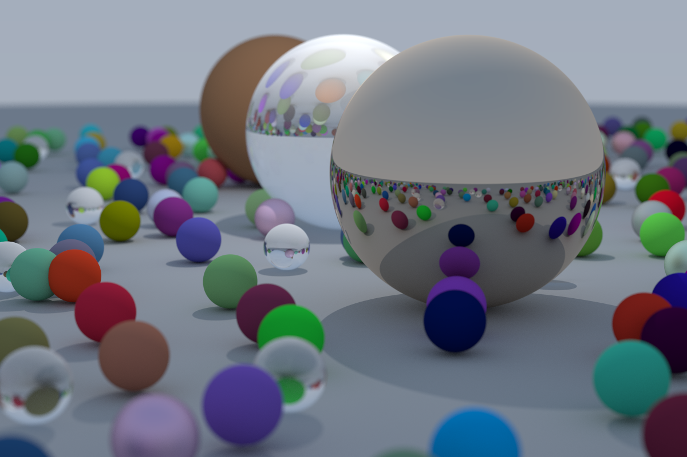

An attempt to learn more complicated Rust topics by building a ray tracer
following [_Ray Tracing in One
Weekend_](https://raytracing.github.io/books/RayTracingInOneWeekend.html). I'm
slowly playing with and adding features beyond the first book in this series too
(e.g. lights).

**Warning**: Some parts of the code are deliberately over-complicated / poor
design. This is because I wanted to learn things like how to clone a vector of
boxed traits or what the pros-and-cons of traits vs. an enum of structs for
shared behaviour is. I have also pressed ahead with some details of the
algorithm after skimming other sources, without working through the math myself.
There are most likely bugs land mistakes lurking here.

### Example render

